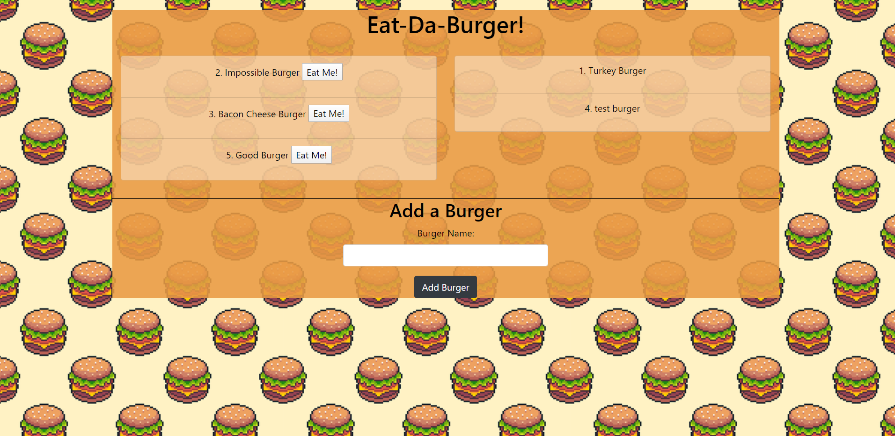

# burger-eater
by: Garrett Reichman  
https://frozen-island-56616.herokuapp.com/

## Description

    This app was made to practice working with a more complex and modular work environment. It uses express handlebars to create and render the html to the browser, the mysql package to connect it to a database, and an ORM file to handle database queries.

## Usage

    To use this app, visit the page linked above. Once there, you may either eat one of the burgers listed on the left by clicking the "Eat Me!" button beside its name, add a new burger using the text box and button below, or view the previously eaten burgers that are listed on the right side of the page.

